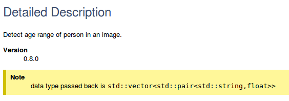

# Callback tutorial
-------

## Content
- [Introduction](#introduction)
- [std::function](#function)
- [std::bind](#bind)
- [Lamba functions](#lambda)
- [Important!](#important)


## Introduction
Since C++11, a `callback` is a [callable](http://en.cppreference.com/w/cpp/concept/Callable) accepted by a class or function, used to customize the current logic depending on that callback.

One reason to use callbacks is to write generic code which is independant from the logic in the called function and can be reused with different callbacks.

When making cloud calls, and due to their asyncrhonous nature, we pass callback parameters.
This approach is common throught the entire API; almost all cloud calls expect you to pass a callback functor.

Your callback can also be a class method, which is bound using `std::bind` or `boost::bind`,
however we suggest you use lambdas or `std::function` when starting.

There are different methods to implement the callback:
* Callable `std::function` objects
* Function pointer, e.g., `void (*cb)(...)`
* Templated functors `T::callback(...)`

**For more information about all type of callbacks, see** [here](http://stackoverflow.com/questions/2298242/callback-functions-in-c).

Class template std::function is a [general-purpose polymorphic function wrapper](http://en.cppreference.com/w/cpp/utility/functional/function).

For example, a definition of a `std::function`:

```cpp
std::function<void(int)>
```

Where `int` is the input arguments of this function and `void` is the return type.
There are three ways to use it:

### function
In this case you only need to have a function and initialize the `std::function` with this function.
For example:

```cpp
void print_int(int i)
{
    std::cout << i << std::endl;
}

int main() 
{
    std::function<void(int)> f_print = print_int;
    f_print(5);
    return 0;
}
```

__**Take care to use the same arguments and return type**__

### bind
The function template bind generates a [forwarding call wrapper for a callable object](http://en.cppreference.com/w/cpp/utility/functional/bind).

For example:

```cpp
void print_int(int i)
{
    std::cout << i << std::endl;
}

int main() 
{
    std::function<void(int)> f_print = std::bind(print_int, std::placeholders::_1);
    f_print(5);
    return 0;
}
```

In this case we are invoking `print_int` and forward the arguments with `std::bind`.
The `std::placeholders::_1` serves as the placeholder for the argument `int i` of the callable function.
For more information about `std::placeholders` see [here](http://en.cppreference.com/w/cpp/utility/functional/placeholders).

You may use *binding* with class objects and instances, for example:

```cpp
class Foo
{
public:
    Foo(int num) : num_(num) {}
    void print_add(int i) const { std::cout << num_ + i << std::endl; }
private:
    int num_;
};

int main() 
{
    Foo num(5);
    std::function<void(int)> f_add = std::bind(&Foo::print_add, num, std::placeholders::_1);
    f_add(2);
    return 0;
}
```

In this case we are associating our `std::function` with class method `Foo::print_add`.
Example in NOOS API can be found [here](../class_reactor/README.md).

### Lambda

A lambda function is an [anonymous inline function](http://en.cppreference.com/w/cpp/language/lambda).
Similar to the previous examples:

```cpp
int main() 
{    
    auto f_add = [](int a) { std::cout << a << std::endl; };
    f_add(2);
    return 0;
}
```

Assigning a lambda to an `std::function` can be done like so:

```cpp
int main() 
{    
    std::function<void(int)> f_add;
    f_add = [](int a) { std::cout << a << std::endl; };
    f_add(2);
    return 0;
}
```

__NOTE__ Since `C++14/C++1Y` we can use [auto specifier](http://en.cppreference.com/w/cpp/language/auto) to declare variables and lambda parameters.

Most of the examples of NOOS API you'll find a lambda callback with the input arguments depending of the cloud call being used.

The callback will be executed by the API, when a reply is received by the cloud platform.

### Important!
Depending on the service that it is called, the variables need it are differents.
To find which type of data you are going to receive, check the [API documentation](https://docs.noos.cloud/)


